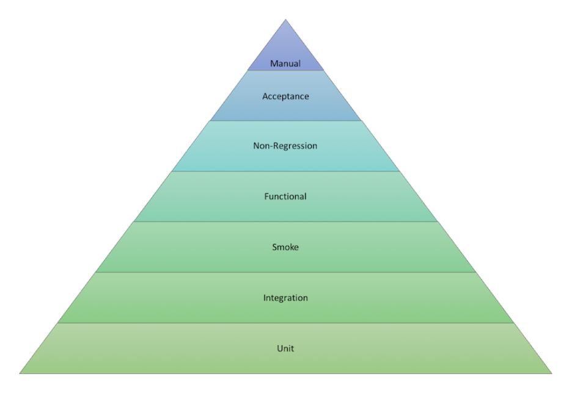

# Software Testing

Testing is a critical component of the software development cycle. Include a good set of tests as part of your pipeline so your team can:

- Validate that the software meets its goals.
- Search for defects that can be fixed to improve software quality.
- Facilitate refactoring and upgrades by validating that everything is still working after the changes are applied.

This section provides an overview of the role and structure of testing in the build cycle. It does not attempt to teach you how to create a complete and excellent set of tests for your project; if you want to learn more about good testing practices, the end of this section suggests some resources that are available.

Good testing involves many different types of tests:

- Unit testing, integration testing, smoke testing
- Functional testing
- Non-regression testing
- Acceptance testing
- Code quality and static analysis
- Performance and security testing

The build cycle should report and perhaps archive test results.

## Automated Testing

Testing should be automated as much as possible, based on the following principles and practices:

- Tests can be run frequently and always in the same order.
- Running tests frequently means that problems are found early and you usually know which small piece of code caused the problem.
- Automated tests consume machine resources but require little human time beyond what is required to review the test results.
- Tests should be independent from each other as much as possible.
- Many tests can be run in parallel—especially tests that validate your code for different operating systems or JDK versions.
- Define different tests to run at different stages of the build chain.

## Categories of Testing

The testing field has identified different categories of test types; you can find long discussions about the proper definitions of all these types of tests.

Test types can be categorized by how quickly they run. Faster automated test types include:

- **Unit tests** test a small piece of code (a function, method, or command). They run the fastest and are often written by the person who writes the code.
- **Integration tests** validate integration between multiple subsystems, including external subsystems such as a database.
- **Smoke tests** (also known as sanity checking) validate basic functions of the system.

Slower automated test types include:

- **Functional tests** validate the normal software behaviors against the expectations and requirements.
- **Non-regression tests** validate that the system still produces the same result.
- **Acceptance tests** test the full product from the perspective of the end user use cases and sentiment. These tests usually include manual testing.

Manual testing should be performed rarely, and only on software that has passed all automated tests. It is appropriate when the test result is subjective, such as user experience testing, and when the cost of automation is excessive.

## The Testing Portfolio

Jenkins enables you to run large numbers of tests frequently and at appropriate stages in the build cycle.

Your testing portfolio should have more low-level tests than high-level tests.

- Unit tests usually run every time you compile the code.
- You can define whether functional and non-regression tests run if the unit tests fail.
- Large, broad tests can be set up to run periodically (for example, during non-work hours) rather than being run each time new code is committed.

The Testing Pyramid is a visual representation of these principles:

Therefore, the following principles should be reflected in your testing portfolio:

- The low-level tests at the bottom of the pyramid run quickly and inexpensively and should be run very frequently.
- The higher-level tests at the top of the pyramid take more time to run and are expensive; they should be run less frequently and only on software that has passed all the tests that are lower on the pyramid.
- When low-level tests fail, it seldom makes sense to run higher-level tests before fixing the problems detected by the low-level tests.
- When a higher-level test fails, consider that it may have detected a defect in the lower-level tests as well as a defect in the code.

## Difference Between Testing and Building in Jenkins (or IT Industry)

| Aspect             | Testing                                                                 | Building                                                        |
|--------------------|-------------------------------------------------------------------------|-----------------------------------------------------------------|
| Purpose            | Validate the functionality, performance, and security of the code       | Compile and package the code into a usable format               |
| Focus              | Finding defects and ensuring quality                                    | Creating executable artifacts                                   |
| Automation         | Often involves automated test scripts (unit tests, integration tests)   | Typically involves build tools like Maven, Gradle, or Ant       |
| Frequency          | Run frequently during development and CI processes                      | Usually triggered by code changes or scheduled builds           |
| Outcome            | Test reports indicating pass/fail status, coverage, and performance     | Build artifacts like binaries, libraries, or Docker images      |
| Tools              | Testing frameworks (JUnit, Selenium), static analysis tools (SonarQube) | Build tools (Jenkins, Travis CI), compilers, and packagers      |
| Dependencies       | Requires the built code to be available                                 | May need dependencies to be fetched and compiled                |
| Impact of Failure  | Indicates issues that need to be fixed before release                   | Prevents the generation of executable artifacts if failed       |
| Examples           | Unit testing, integration testing, performance testing                  | Compiling code, packaging applications, generating Docker images|

For more information, you can refer to specific resources or documentation related to testing and building practices in Jenkins and the IT industry.
