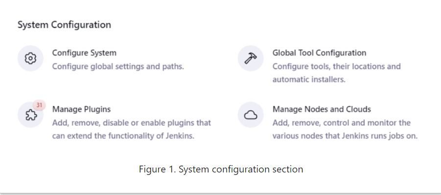
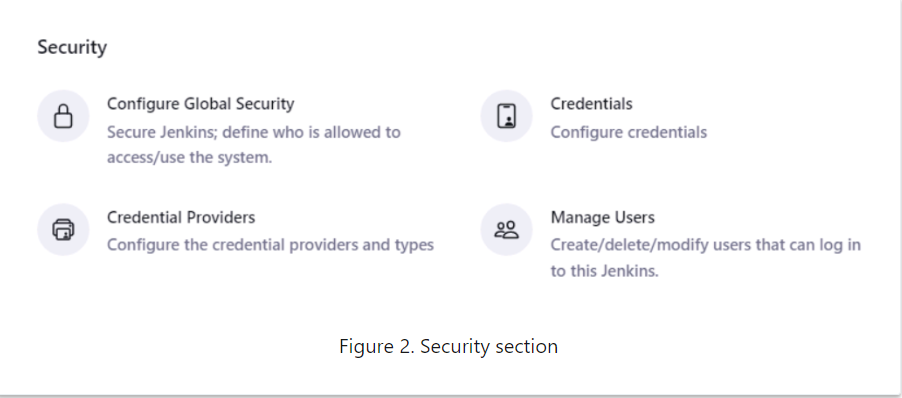
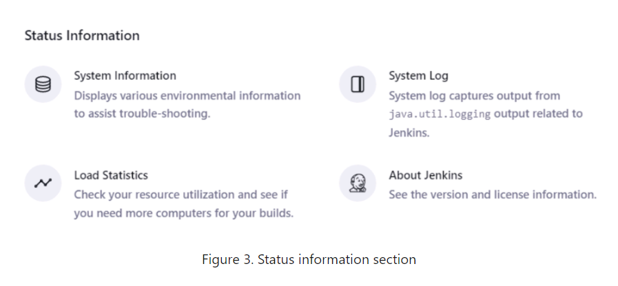
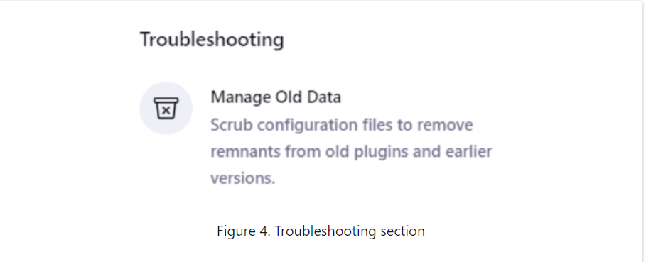
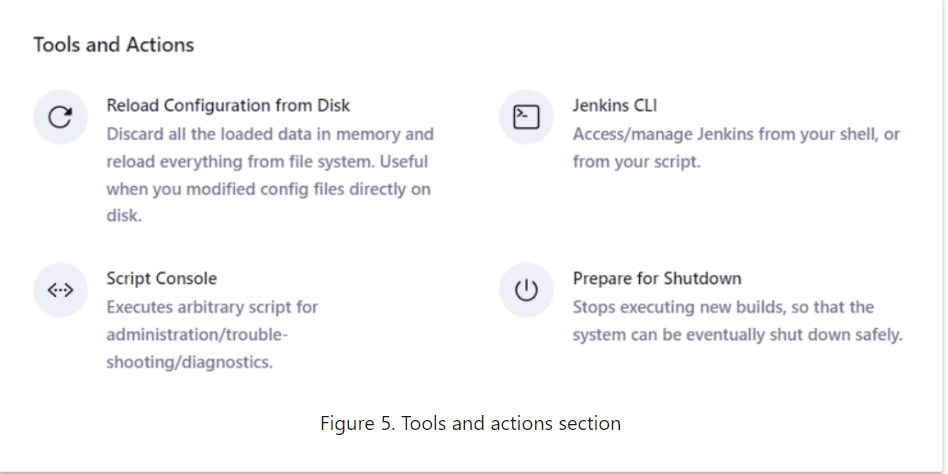

# Meet the Manage Jenkins Screens

Most administrative tasks are performed from the screens under the Manage Jenkins section of the dashboard. Select Manage Jenkins on the Jenkins dashboard to access this section.

We are now going to take a quick tour of this page now. Major portions of the dashboard will be discussed in other sections of this class.

The top of the screen might contain "Monitors" that alert you when a new version of the Jenkins software or a security update is available. Each monitor includes links to the changelog that describes the new update as well as instructions to download and install the update.

The Manage Jenkins page displays a series of tiles for common task areas, arranged in logical groupings:

## System Configuration

Screens for general system configuration, managing nodes and clouds, global tool configuration, and plugin management.

## Security

Screens to configure global security (authentication, authorization, and global settings that protect your Jenkins instance from intrusions) and screens to manage the credentials that provide secure access third-party sites and applications that interact with Jenkins.

## Status Information

Screens that display system information, information about disk usage, the Jenkins system log, "about Jenkins" information, and load statistics for the instance.

## Troubleshooting

Screens to help you resolve configuration issues.

## Tools and Actions

Screens for common management tasks (reloading the configuration from disk, preparing for shutdown) and management tools that enable you to administer Jenkins from the command line (Jenkins CLI and the Script Console), with any additional tools available based on the plugins you install.

### Some Handy Pages

Some Manage Jenkins pages provide reference material about your Jenkins instance and what is available on it. These are discussed here.

### About Jenkins

The Manage Jenkins About Jenkins page shows the current release of Jenkins on your system plus information about licenses for all components. The left shows the release and version of Jenkins that is running.

The following information about your Jenkins cluster is also provided:

- List of Mavenized dependencies that lists all third-party libraries used for this release of Jenkins, with links to licensing details about each library.
- List of Static resources that are installed, such as fonts and themes.
- List of installed plugins, each of which includes a link to the page that shows all third-party dependencies for each plugin with a link to licensing details about each library.

### System Information

The Manage Jenkins System Information page provides detailed information about what is available on this Jenkins instance:

- System Properties that can be used as arguments to the command line used to start Jenkins.
- Environment Variables recognized on this system, with current values. This includes the environment variables defined by Jenkins and available on all systems as well as environment variables associated with plugins installed on this instance.
- List of Plugins installed on the system.
- Memory Usage gives a graph that shows the current memory usage for this instance.
- Thread Dumps lists all of the Java threads running in a VM, which can help diagnose performance or deadlock issues.
