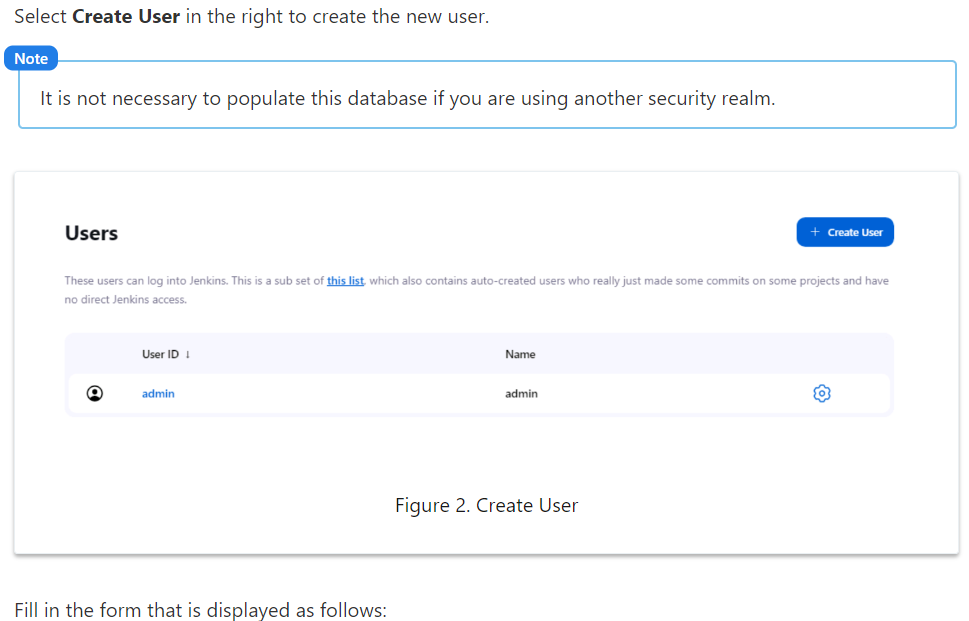

# Jenkins Authentication

Authentication is the set of tools and procedures that identify users and allow them to access Jenkins. Real-world examples of authentication include:

- When police check your ID, it is authentication.
- Using a login and a password is an authentication.
- Biometrics are also a type of authentication.
- 2FA, which stands for "Two Factor Authentication," is a stronger authentication scheme.

## Security Realm

Setting the security realm tells Jenkins which "referential" to use for authentication. The security realm is a dedicated database for users and passwords. It defines the security implementation used to establish the identity of users.

Jenkins supports many different authentication systems through security realms, but only one security realm can be active at a time. Users who are not authenticated are always bound to the "anonymous" special user.

In most cases, Jenkins is configured to use the security implementation that is already in place for the organization. Jenkins supports four realms out of the box:

- Jenkins User database
- Unix user/group database
- Servlet container
- External LDAP

Additional security implementations such as Active Directory and the SAML 2.0 Single Sign-On facility can be added with plugins.

By default, users and groups come from the Jenkins internal user database. Smaller, more informal installations can use this internal database, but enterprise installations usually use a corporate service (LDAP, AD, or UNIX), so that users can log into Jenkins with their usual username and password.

## Managing Plugins for Authentication

To see a list of all plugins for alternate security realms and other authentication tools:

1. Go to **Manage Jenkins** > **Manage Plugins**.
2. Select the **Available** tab.
3. Enter "Authentication and User Management" into the search box.

This displays a list of relevant plugins. You can right-click the name of any plugin to read more about it.

For demonstrations and testing, consider using the Mock Security Realm. This provides an insecure security realm that is easy to set up.

## Configuring the Security Realm

Choose the security realm used to authenticate users on the **Manage Jenkins** > **Global Security** page.

