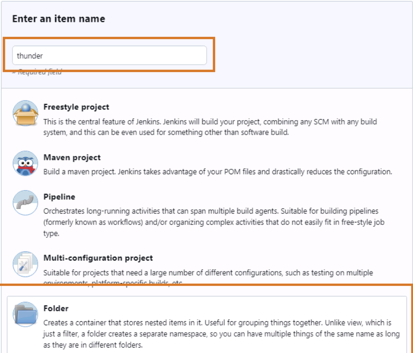
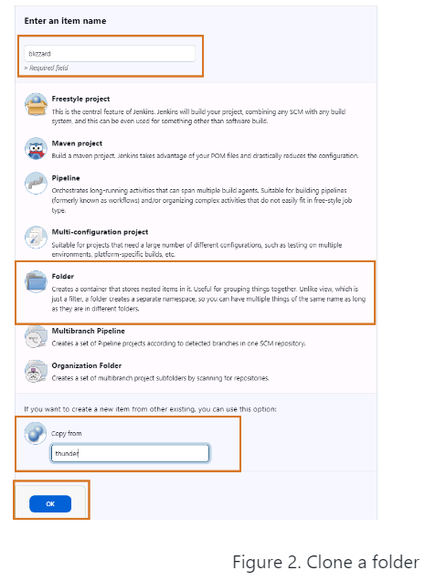
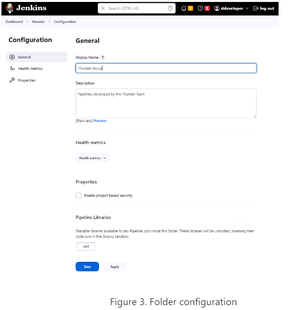
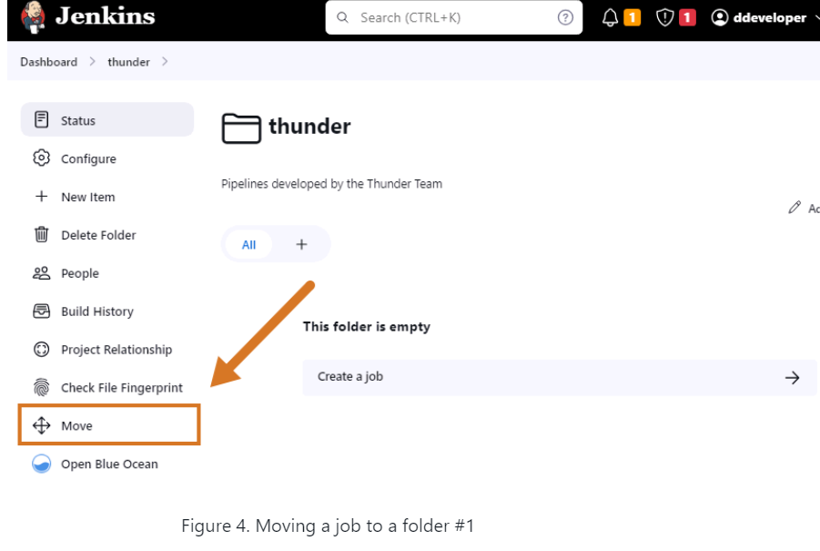
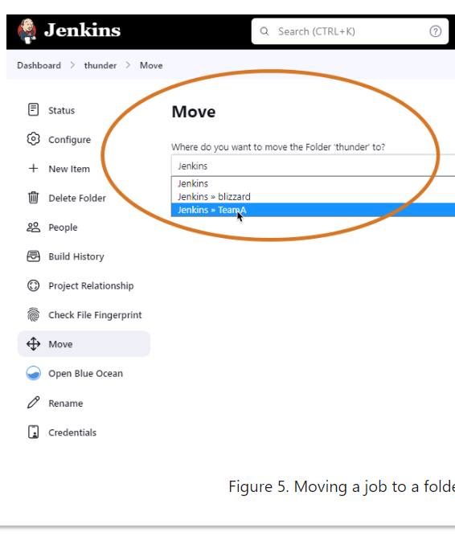

# Folders in Jenkins

## Overview

Folders in Jenkins provide separate namespaces for different projects or teams on the same controller. Each folder is isolated from others, allowing distinct management of jobs and resources within it. This simplifies branch and Pipeline management by organizing related jobs together.

Properties and resources defined within a folder are scoped to that folder. For instance, credentials assigned to a folder can only be used by Pipelines within that folder.

Folders can also be nested, similar to file system directories:

Folder 1

Folder 2

Folder 3 … Folder n

## Creating a Folder

To create a new folder in Jenkins:

1. Click **New Item** on the Jenkins dashboard.
2. Enter a name for the folder and select **Folder**.
3. Click **OK**.

## Cloning a Folder

To clone an existing folder:

1. Fill in the **Copy from** field with the name of the folder you want to clone.
2. Click **OK**.

## Configuring a Folder

When creating or cloning a folder, you can configure it by:

- Providing a **Display Name** (optional).
- Adding a **Description**.
- Exploring other configuration options available for advanced settings.

## Moving a Job to a Folder

To move a Pipeline project to a folder:

1. Navigate to the Jenkins dashboard.
2. Click on the Pipeline project you want to move.
3. Click **Move** in the left frame.
4. Select the destination folder where you want to move this project.

