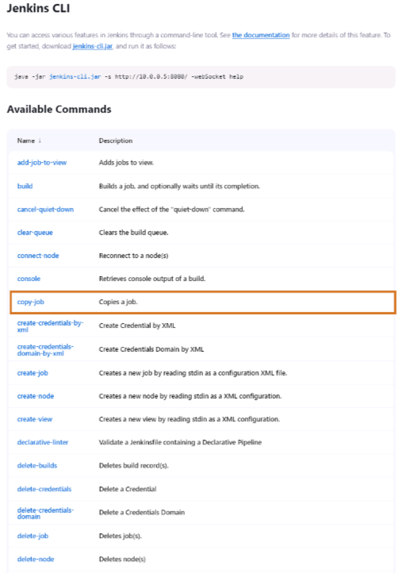

# Automate Jenkins

In this class, we have mainly looked at how to administer a Jenkins instance from the graphical Jenkins dashboard, which is a good way to get started with Jenkins administration. But many administrative tasks can be accomplished with command-line tools, which is often more efficient.

Scripting allows you to automate and standardize routine tasks, bulk updates, troubleshooting, and more. It provides consistency and efficiency for different staff members and at different times.

This lesson discusses the following facilities:

## Jenkins CLI

The Jenkins Command Line Interface (CLI) provides commands to perform functions that are usually executed using the UI. These can be used in scripts that automate administrative tasks. The Jenkins CLI page lists CLI commands that are supported on your instance and can be used to automate Jenkins administration.

The Jenkins CLI can be accessed over SSH or with the Jenkins CLI client, which is a `.jar` file distributed with Jenkins.

### Jenkins CLI Example: Build Command

The CLI build command is the equivalent of clicking "Build Now". It can take these parameters:

- `-c`: Run polling first and build only if there is a change.
- `-s`: Do not just schedule but wait until the build is completed.
- `-p`: Specify build parameters.
- `-v`: Report console output as well.

### Jenkins CLI Example: CRUD Jobs

The CLI CRUD commands (`create-job`, `get-job`, `update-job`, and `delete-job`) can be used to script job creation and updates. These commands read/write the XML representation of the job and use the stdin/stdout of the CLI process.

## Jenkins Remote-Access API

The Jenkins remote-access API allows you to access Jenkins programmatically, making it possible to automate tasks using scripts in various programming languages.

## Groovy Scripts in Script Console

Groovy scripts can be executed directly on the Jenkins server via the Script Console. This is useful for performing administrative tasks and troubleshooting directly within the Jenkins environment.

## Jenkins Configuration as Code (CasC)

Jenkins Configuration as Code (CasC) allows you to define Jenkins configuration in YAML files stored under SCM. This approach automates Jenkins configuration setup and is useful for maintaining consistency across environments.

Plugins can contribute additional commands to the Jenkins CLI, expanding its functionality beyond core commands provided by Jenkins.

Jenkins CLI and other scripting methods enable efficient automation and management of Jenkins instances, promoting consistency and reliability in software delivery pipelines.
